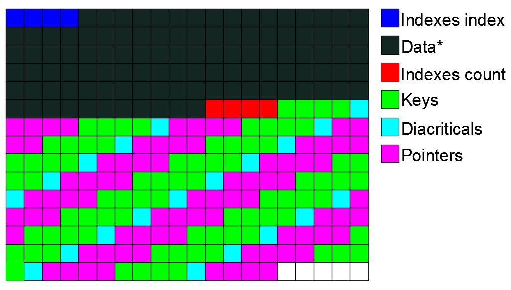

# Format de fichier d2i

Le format de fichier d2i est un format créer par Ankama pour qui à pour but de stocker des chaines de caractères (nom des items, dialogues des pnjs, etc...) correspondant à des clés, ce sont les fichiers "langues" du client.

### La structure d’un fichier d2i :
* L'indexe des indexes (int)
* Les données (chaines de caractères précédé de leur longueur)
* La table des indexes
    * Le nombre d'indexes (int)  
    * [--Répétition des 4 prochains points jusqu'a la fin du fichier--]
    * La clé (int)
    * Indicateur diacritique (bool)
    * Le pointeur (int)
    * Le pointeur diacritique (int) (non représenté sur le schema)

note : dans la représentation ci-dessous il est considéré qu'aucunes des données ne comporte de chaines diacritiques

### L'indexe des indexes :

Correspond à l'offset de la table des indexes

### Les données :

Un short contenant la longueur de la chaine puis la chaine de caractères

### La table des indexes :

Le nombre d'indexes puis les indexes

### Les indexes :

Les indexes sont composé de 3 à 4 elements :

1. La clé : Appelé par exemple dans les fichiers d2o, c'est le "numéro d'identification" de la donnée
2. Indicateur diacritique : Indique si il existe une donnée diacritique pour cette clé
3. Pointeur : Emplacement de la chaine
4. Pointeur diacritique : Emplacement de la chaine diacritique si existante

# Informations suplémentaires
- [Définition du terme : diacritique](https://fr.wikipedia.org/wiki/Diacritique)