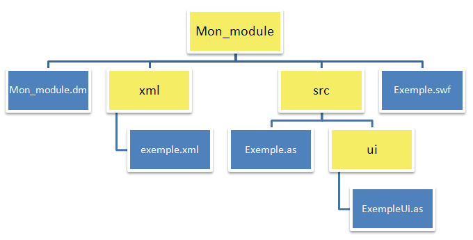
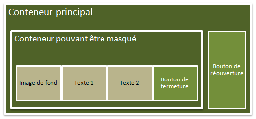
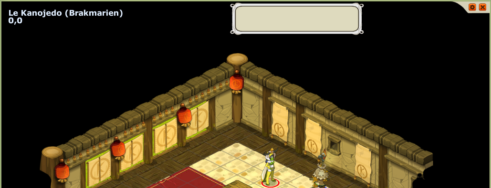

Un module Dofus est composé des éléments suivant :

- Un fichier de description du module `.dm`
- Un dossier `xml` contenant les fichiers de description des interfaces
- Un dossier `src` (pour 'source') contenant :
 - Un fichier ActionScript `.as` contenant le code du module
 - Un dossier `ui` contenant les fichiers ActionScript `.as` qui compose l'interface graphique
- Un fichier flash `.swf`, résultat de la compilation du module



Le but est donc de créer tous ces fichiers avant de pouvoir admirer notre nouvelle interface.

Afin que ces explications soient un peu plus concrètes, elles seront basées sur un module d'exemple dont le fonctionnement est le suivant : au lancement du combat, une fois tous les combattants prêts, l'interface s'affiche, puis à chaque modification du nombre de créatures qu'il est encore possible d'invoquer, l'interface est mise à jour pour afficher ce nombre ainsi que le maximum d'invocations, jusqu'à la fin du combat, où l'interface est déchargée.

La première étape consiste donc à créer un projet sur FlashDevelop pour votre module, puis les sous-dossier `xml`, `src` et `src/ui`.

## Les fichiers de description

Les fichiers de description vont permettre de décrire le module en listant ses interfaces, fichier `.dm`, et chaque interface en listant ses composants, fichier `.xml`.

**Le fichier de description du module .dm**

Créez dans votre dossier, un nouveau document texte. Son nom n'a pas d'importance, mais son extension doit obligatoirement être ".dm". Ouvrez le à l'aide de votre éditeur de texte préféré.

Ce fichier au format XML, a pour but de décrire les interfaces de votre module. Quelques règles de base :

- Les mots-clé entourés de chevrons (< et >) sont appelés des balises, et une balise ouverte doit toujours être suivie d'une balise fermante (ex : <module> ... </module>).
- Les balises doivent s'imbriquer correctement (ex: `<module><uis>...</uis></module>` fonctionne mais pas `<module><uis>...</module></uis>`), aucun chevauchement n'est autorisé.
- Le nom des balises, des attributs et les valeurs sont sensibles à la casse (ex: `<uis>` est différent de `<Uis>`).
- La syntaxe des commentaires est : `<!-- Je suis un commentaire -->`

Un fichier de description de module ressemble donc à une liste de balises.

Mais regardons plus en détail chaque partie :

```xml
<module>
    <header>
        <name>Mon_module</name>
        <version>0.1</version>
        <dofusVersion>2.29.0</dofusVersion>
        <author>Ankama</author>
        <shortDescription>Module d'exemple : nombre d'invocations possibles</shortDescription>
        <description>Ce module affiche, en combat, une petite interface donnant le nombre d'invocations possibles, pour savoir en permanence si l'on peut invoquer ou non.</description>
	</header>
    <uis>
        <ui name="exemple" file="xml/exemple.xml" class="ui::ExempleUi" />
    </uis>
    <script>Exemple.swf</script>
</module>
```

Ces informations seront affichées dans la liste des modules en jeu, elles doivent donc être claires et précises.

- Le nom est celui sous lequel vous voulez que votre module apparaisse, son nom "public". Il peut tout a fait être différent du nom de votre dossier ou de celui du fichier flash principal (swf). Les caractères spéciaux et accentués sont autorisés.
- La version de départ de votre module est 0.1. Le premier chiffre correspond à la version publiée, il augmente à chaque nouvelle version. Le second chiffre correspond à l'ajout de fonctionnalités, ou l'amélioration de la version actuelle.
- Pour connaitre la version de dofus pour laquelle votre module fonctionne, il vous suffit de lancer le jeu et taper `/version` dans le chat : les trois premiers chiffres après DOFUS CLIENT v sont ceux qui nous intéressent.
- L'auteur, c'est facile, c'est vous.
- La description courte doit décrire votre module sans dépasser, de préférence, une cinquantaine de caractères.
- La description détaillée permet de décrire clairement le module, son fonctionnement, son principe, son but.
- L'icone de votre module permet de le repérer plus facilement dans la liste, c'est une image de taille 48x48, au format png de préférence.


Entre les balises `uis` sont listées toutes les interfaces de notre module. Dans cette exemple, nous n'avons qu'une interface.

- L'attribut name correspond au nom de l'interface. Ce nom sera utilisé pour charger ou décharger l'interface, évitez donc les caractères spéciaux ou accentués qui pourraient poser problème.
- L'attribut file correspond au chemin du fichier `.xml` de description de l'interface, à partir de la racine de votre module, c'est-à-dire le dossier principal.
- L'attribut class correspond au chemin de la classe `.as` de script de l'interface, à partir du dossier `src` (notez bien qu'il ne faut pas ajouter de ".as" à la fin de son nom).

(NB : Votre module peut contenir autant d'interfaces que vous le désirez. Il est toutefois préférable de ne pas y réunir des interfaces trop différentes mais, au contraire, de les regrouper par thèmes dans plusieurs modules afin de permettre aux utilisateurs de choisir plus facilement ceux dont ils ont besoin.)

Entre les balises `script` doit figurer le nom du fichier flash `.swf` de votre module.

Une fois ce fichier rempli, enregistrez le et fermez le. Il ne devrait plus être nécessaire d'y retoucher avant que vous souhaitiez ajouter de nouvelles fonctionnalités à votre module, et donc modifier son numéro de version.

**Le fichier de description de l'interface .xml**

Ce fichier au format XML, va servir à définir l'apparence de l'interface, en plaçant et paramétrant les composants qui la composeront.

L'interface est la partie visible du module, qui permet des échanges et interactions entre le joueur et le jeu. Avant de commencer, il est donc important d'avoir une image mentale (ou sur papier, un bon schéma aide toujours) claire de son fonctionnement.

- Quelles informations voulez-vous qu'elle affiche ?
- Sous quelle forme ?
- Quelles actions le joueur va t-il pouvoir exécuter sur cette interface ?
- Quelles modifications visuelles doivent en découler ?

Dans notre cas : 

- Le nombre d'invocations possibles et le maximum du personnage,
- Un simple texte,
- La fermer, ou l'ouvrir,
- L'interface devra être masqué, ou ré-affichée.

Il existe une logiciel permettant de concevoir des interfaces, pour cela rendez-vous dans la section [Création d'une interface](https://github.com/LuaxY/OpenDofus/wiki/Modules-:-Cr%C3%A9ation-d'une-interface), mais nous allons ici créer et détailler l'interface à la main.

**Prologue et déclarations préalables**

```xml
<?xml version="1.0" encoding="UTF-8"?>
<Definition>

	<!-- Import d'un template pour creer un bouton simple à partir d'une texture -->
	<Import url="[config.mod.template]button/iconButton.xml" />
	
	<Constants>
		<!-- Enregistrement des chemins vers les assets d'interface et les css pour les textes -->
		<Constant name="assets" value="[config.ui.skin]assets.swf|" />
       	<Constant name="css" value="[config.ui.skin]css/" />
   	</Constants>
```

Votre fichier `.xml` devra obligatoirement commencer de la façon suivante

```xml
<?xml version="1.0" encoding="UTF-8"?>
<Definition>
```

La première ligne s'appelle le prologue et permet d'indiquer la version de la norme XML utilisée.

Pour vous aider à placer les différents éléments de l'interface, vous pouvez ajouter `debug="true"` à l'intérieur de la balise Definition, pour que chaque composant soit coloré. Cela vous permettra de voir plus facilement si un composant dépasse, ou où se trouvent vos conteneurs vides.

Ensuite,

```xml
    <Import url="[config.mod.template]button/iconButton.xml" />
```

permet d'importer le template iconButton (image réagissant comme un bouton, utilisée pour tous les boutons ne contenant pas de texte). Les templates s'utilisent comme des composants normaux et permettent de ne pas avoir à réécrire de nombreuses lignes à chaque fois qu'on souhaite ajouter un bouton : le paramétrage complet du composant ButtonContainer se fait dans le template et il ne nous reste qu'à utiliser ce template en modifiant les paramètres utiles pour notre bouton. Nous reviendrons sur ce point un peu plus tard.

```xml
    <Constants>
        <Constant name="assets" value="[config.ui.skin]assets.swf|" />
        <Constant name="css" value="[config.ui.skin]css/" />
    </Constants> 
```

Cette dernière partie de déclaration de constantes n'est pas obligatoire, mais elle permet d'agréables simplifications de syntaxe. En effet, grâce à la constante assets, par exemple, vous pouvez paramétrer les composants texture avec [local.assets]btn_cornerCross au lieu de [config.ui.skin]assets.swf|btn_cornerCross.

Une fois le prologue ajouté, les imports faits et les constantes déclarées, passons au principal : les composants de notre interface.

**Composants**

De quoi avons-nous besoin ?

Dans notre exemple, nous voulons connaitre le nombre d'invocations possibles, tout au long du combat, sans avoir à le calculer de tête. 

- Il va donc nous falloir un champ texte pour afficher cette valeur.
- Pour que notre interface soit compréhensible par tout le monde, nous allons aussi mettre un second champ texte, expliquant ce que la valeur numérique signifie. Il est plus pratique de faire deux composants différents plutôt qu'un seul champ texte contenant l'intitulé et la valeur. En effet, ainsi, nous n'aurons pas besoin de garder le texte de l'intitulé dans le code de l'interface et de le replacer dans le champ texte à chaque modification de la valeur.
- Il nous faut un fond, à placer derrière les textes, pour la lisibilité.

On pourrait s'arrêter là, mais, en combat, toutes les interfaces s'affichant au dessus de la map peuvent potentiellement être gênantes pour cibler des monstres et des joueurs, il est donc toujours préférable de prévoir un bouton de fermeture de l'interface.

De plus, étant donné que notre interface ne s'ouvre qu'au lancement de combat, il nous faut un bouton discret et ne gênant pas les combats, pour la ré-ouvrir.

Une fois les besoins en composants "visibles" listés, vous pouvez faire un rapide schéma pour savoir de quelle façon ils seront placés les uns par rapport aux autres et sur la fenêtre de jeu.

Ce croquis permet aussi de voir plus facilement les conteneurs qu'il va nous falloir. En effet, ils vont être d'une grande aide pour déplacer ou masquer un ensemble de composants. Par exemple, ici, nous voulons pouvoir masquer l'image de fond, les deux textes et le bouton de fermeture en même temps, il faudra donc les mettre tous les quatre dans un conteneur.



Notons que l'interface est forcément englobée dans un conteneur principal.  
A présent que tout est bien clair dans notre esprit, il est temps de repasser au fichier `.xml` de l'interface.

**Le XML de description**

Quelques points à retenir :

- Il n'est pas nécessaire de donner un nom aux composants qui ne seront pas modifiés ou utilisés : dans l'exemple, le conteneur principal, la texture de fond, et le texte d'intitulé resteront fixes et inchangés, nous ne les nommerons donc pas. Par contre le texte modifiable, les boutons et le conteneur à masquer doivent obligatoirement être nommés pour pouvoir être appelés dans le script d'interface.
- Tous les éléments sont toujours placés par rapport au conteneur parent. C'est-à-dire que le conteneur principal est placé de base en 0,0, en haut à gauche de la fenêtre de jeu, puis le second conteneur masquable est placé en haut à gauche du premier conteneur, etc... Ainsi, pour placer notre interface, il nous suffit de modifier le positionnement du conteneur principal, et tout le reste suivra.
- Les différents composants de l'interface seront affichés en jeu dans le même ordre que dans notre fichier XML. Il faut donc toujours commencer par décrire les composants qui seront le plus en arrière-plan de notre interface, puis continuer vers le premier plan.
- L'indentation (le décalage des lignes d'un ou plusieurs crans vers la droite, avec tab) n'est pas obligatoire, mais elle permet une bien meilleure lisibilité, conservez-la au maximum.

C'est parti !

```xml
    <Container>
        <Anchors>
            <Anchor>
                <AbsDimension x="600" y="3" />
            </Anchor>
        </Anchors>
```

On commence par placer le conteneur principal, qui contiendra l'interface toute entière, tout en haut de l'écran, au milieu. C'est là qu'il gênera le moins les autres interfaces. Il n'est pas nécessaire de lui donner une taille : il prendra automatiquement la taille de ce qu'il contient.

```xml
        <Container name="ctr_concealable">
```

Puis, le second conteneur, qui pourra être masqué. Il sera placé en 0,0 par rapport au conteneur parent, et prendra la taille de son contenu, il n'a donc besoin d'aucun paramètre.  
Maintenant qu'on est à l'intérieur du second conteneur, on va ajouter les composants masquables.

```xml
            <Texture>
                <Size>
                    <AbsDimension x="350" y="85" />
                </Size>
                <uri>[local.assets]tx_generalBackground</uri>
                <autoGrid>true</autoGrid>
            </Texture>
```

On commence par la texture de fond, en fixant sa taille (on pourra très facilement la modifier si ça ne convenait pas, n'hésitez pas à faire des essais). On indique ensuite le chemin vers l'image que l'on souhaite utiliser : dans notre cas, c'est le fond de base, tout simple, des interfaces (et si jamais vous voulez mettre un fond de base avec bandeau sombre sous le titre, pensez à l'asset `tx_generalBackgroundWithTitle`). Comme vu dans la documentation des composants `autoGrid` permet un redimensionnement de l'image sans étirer les coins, il ne faut donc pas l'oublier pour les textures de fond.



```xml
            <Label>
                <Anchors>
                    <Anchor>
                        <AbsDimension x="19" y="15" />
                    </Anchor>
                </Anchors>
                <Size>
                    <AbsDimension x="310" y="20" />
                </Size>
                <text>Nombre d'invocations possibles :</text>
                <css>[local.css]normal.css</css>
            </Label>

            <Label name="lb_nbSummonable">
                <Anchors>
                    <Anchor>
                        <AbsDimension x="19" y="40" />
                    </Anchor>
                </Anchors>
                <Size>
                    <AbsDimension x="310" y="20" />
                </Size>
                <css>[local.css]normal.css</css>
                <cssClass>center</cssClass>
            </Label>
```

Au dessus de notre texture de fond, on place les labels. Lorsqu'on utilise le css `normal.css`, la meilleure hauteur pour un label est de 20. Mettre plus de 20 est inutile, et à moins de 20, le texte sera tronqué.


```xml
            <iconButton name="btn_close">
                <Anchors>
                    <Anchor point="TOPRIGHT" relativePoint="TOPRIGHT">
                        <AbsDimension x="1" y="-2" />
                    </Anchor>
                </Anchors>
                <Size>
                    <AbsDimension x="57" y="36" />
                </Size>
                <uri>[local.assets]btn_cornerCross</uri>
            </iconButton>
```

On ajoute le bouton de fermeture (qui est en réalité un bouton pour masquer le second conteneur et non pour fermer l'interface), en fixant son coin (point) en haut à droite au coin (`relativePoint`) en haut à droite du conteneur parent, c'est-à-dire ce second conteneur, qui lui-même a pris la taille de la texture de fond. 


```xml
       </Container>
```

On a fini pour les composants devant être masqués, on referme donc le second conteneur.

```xml
        <iconButton name="btn_open">
            <Anchors>
                <Anchor point="TOPRIGHT" relativePoint="TOPRIGHT">
                    <AbsDimension x="-5" y="4" />
                </Anchor>
            </Anchors>
            <Size>
                <AbsDimension x="26" y="26" />
            </Size>
            <uri>[local.assets]btn_plus_square</uri>
            <visible>false</visible>
        </iconButton>
```

On ajoute le bouton de réouverture, placé au même endroit que celui de fermeture, puisque même si ce bouton est placé par rapport au conteneur principal, ce dernier prend la taille du second conteneur et a la même position. La taille des boutons étant différente, on fait tout de même quelques petits ajustements pour le positionnement. On passe ce bouton invisible de base, on ne le rendra visible que lorsque le second conteneur sera masqué.

```xml
    </Container>
</Definition>
```

Et on finit en refermant notre conteneur principal et la balise de base, qu'on avait ouvert juste après le prologue.

La description de l'interface est maintenant finie, tous les composants sont bien paramétrés. On peut enregistrer ce fichier sous `exemple.xml` ou n'importe quel nom qui avait été défini dans le fichier `.dm`.  
Afin d'être sur qu'aucune erreur de syntaxe ne s'est glissée dans votre fichier `.xml`, pensez à l'ouvrir avec un navigateur web.

Il faut maintenant passer aux scripts pour la mise à jour et les interactions de notre interface.

**Les scripts .as**
