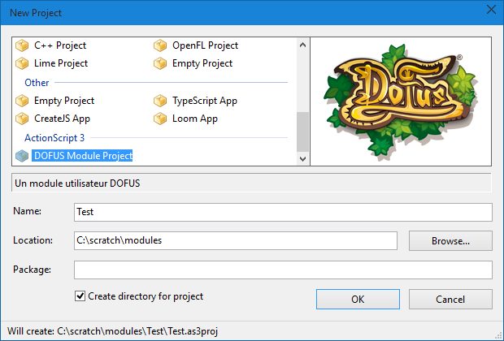

Les modules Dofus permettent de d’enrichir le client avec de nouvelle interface et interaction. Vous allez pouvoir recréer une interface pour par exemple l'amélioration de la gestion de guilde ou même créer un panneau d'administration pour votre serveur.

## Information

Avant de vous lancer dans la création de module, il faut savoir qu'il faut impérativement le [client bêta](http://forum.dofus.com/fr/1557-discussions-generales/1906976-telechargement-client-beta) pour pouvoir lancer des modules non officiel (= créer par des joueurs). Il est toutefois possible de les lancer sur le client release en modifiant celui-ci.

## Pré-requis

- [Adobe AIR](https://get.adobe.com/air/?loc=fr)
- [Client bêta](http://forum.dofus.com/fr/1557-discussions-generales/1906976-telechargement-client-beta)
- [FlashDevelop](http://www.flashdevelop.org/)
- [Mode développement](/Mode-developpement.md)

## Environnement de travail

### SDK

La première chose à faire est de télécharger le SDK pour les modules : [lien vers la dernière version](https://github.com/OpenDofus/wiki/releases/tag/sdk-module)

Le SDK contient les éléments suivants:

- La modules-library, bibliothèque fournissant les fonctionnalités nécessaires en ActionScript 3 pour le développement des modules. Le contenu des sous-dossiers est le suivant:
 - Dans modules-library/bin, la bibliothèque compilée (en swc).
 - Dans modules-library/src, le code source de cette bibliothèque.
 - Dans modules-library/doc, la documentation de référence des fonctionnalités offertes par la bibliothèque. Cette documentation détaille le contenu des classes proposées par la modules-library ainsi qu'une liste des actions disponibles et leur paramétrage (plus de détails sur les actions).
- Le dossier exemple contient le code source de deux modules d'exemple commenté.
- Le fichier dofus-flashdevelop-2.29.0.zip (le numéro correspond à la version du SDK) contient les plugins proposés pour FlashDevelop.
- Le logiciel DofusAssetViewer permettant de visualiser les ressources (images) du client.

### FlashDevelop

FlashDevelop est un IDE complet pour la programmation en ActionScript. Il dispose de nombreuses fonctionnalités utiles pour les développeurs et le SDK permet d'intégrer à l'éditeur la notion de modules Dofus.

Il est nécessaire d'installer certains programmes pour créer puis compiler des modules, toutefois l'utilisation de FlashDevelop n'est pas obligatoire mais fortement recommander pour une mise en place rapide et simple. Il est possible de compiler les modules manuellement en ligne de commande ce qui peu être fort utile pour des serveurs d'intégration (Jenkins, Travis CI, Hudson, etc...)

**Installation et configuration**

Il faut commencer par télécharger puis installer [FlashDevelop](http://www.flashdevelop.org/).
 
Ouvrez ensuite FlashDevelop puis accéder au répertoire des fichier de configuration via le menu **Tools** puis **User Config Files** ([image](../resources/modules/flashdevelop-menu-settings.png)), cela ouvre l'explorateur de fichiers dans le répertoire de personnalisation de FlashDevelop.

Décompressez ensuite le dossier `000 ActionScript 3 - DOFUS Module Project` présent dans `dofus-flashdevelop-{version}.zip` dans le répertoire **Project**.

Vous pouvez vérifier que les projet de type "DOFUS Module Project" soit présent lors de la création d'un nouveau projet



Le nom du module ne doit pas comporter d'espace ni de caractères spéciaux et doit commencer par une majuscule. Le nom du package doit être laissé vide. 

Ensuite, FlashDevelop demandera un nom d'auteur. Ce nom ne doit pas comporter d'espaces ni de caractères spéciaux et doit commencer par une majuscule. Il est important car il sera reporté dans les données du module. Il n'est demandé qu'à la première création de projet, puis sauvegardé par FlashDevelop. 

Le module est maintenant créé et peut être compilé. 

**Compilation**

Le menu Project puis Build Project (ou la touche F8) permet de compiler un module. Si la compilation est un succès, le projet FlashDevelop peut ensuite être copié dans son intégralité dans le répertoire des modules de Dofus (répertoire **Dofus/app/ui**) et fonctionnera (voir [Activer un module](Modules-Activer-un-module.md)).

## Ligne de commande

Si vous ne souhaitez pas développer avec FlashDevelop, ou si votre système d'exploitation ne vous le permet pas, n'importe quel autre IDE peut être utilisé pour la réalisation de modules, en configurant manuellement le compilateur.

Il faudra télécharger le SDK Flex ([cliquez ici](http://sourceforge.net/adobe/flexsdk/wiki/Downloads/)) et choisir la dernière version disponible.

La compilation se fait ensuite à l'aide du programme mxmlc fournis dans le SDK.  
La syntaxe de la commande est la suivante:

```shell
mxmlc -output fichierSortie.swf -source-path repertoireSource -compiler.library-path+=cheminModulesLibrary.swc -keep-as3-metadata Api Module DevMode -- fichierSourcePrincipal.as
```

- fichierSortie.swf le fichier swf résultat de la compilation.
- repertoireSource le répertoire où se trouve le code source du module.
- modulesLibrary.swc le chemin vers le fichier modules-library-{version}.swc.
- fichierSourcePrincipal.as le fichier où se trouve la classe principale du module.

Par exemple, voici la ligne de commande utilisée pour la compilation du module Ankama_Exemple fourni dans le SDK:

```shell
mxmlc -output Exemple.swf -source-path src -compiler.library-path+=../../modules-library/bin/modules-library-2.29.0.swc -keep-as3-metadata Api Module DevMode -- src/Exemple.as
```
